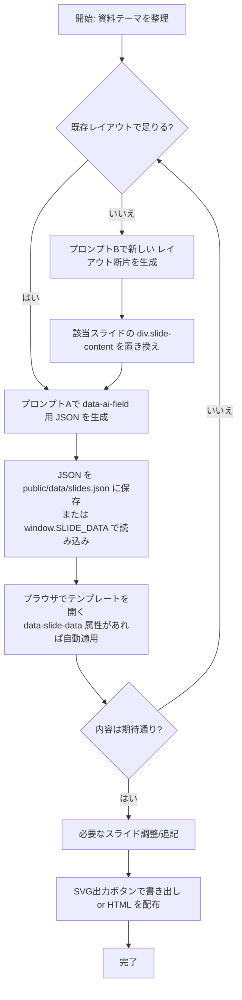

# slide_template

## 概要
`public/slide_template/dual_style_slide_template.html` は、生成AIにコンテンツ作成を任せることを前提にしたHTML単一ファイルのスライドテンプレートです。華美な演出にも社内共有用のシンプルデザインにも対応し、必須スライドとクッションスライドを標準で備えています。

## MyGPT向け推奨設定
テンプレートを最大限活用できるよう、ChatGPT の MyGPT に登録しておくと便利な設定例を表形式でまとめました。

| 項目 | 設定内容 |
| --- | --- |
| 名前（Name） | **推奨設定**: `Dual Style Slide Co-Pilot`<br>**補足**: 生成AIでのコンテンツ差し替えやレイアウト変更を支援するテンプレートであることが端的に伝わる名称です。必須スライドとクッションスライドを標準搭載している点を想起しやすくします。 |
| 説明（Description） | **推奨設定**: `data-ai-field を鍵にJSON差し替えとHTML断片生成を両立させ、SVG出力も備えたエグゼクティブ向けスライドテンプレートの制作を支援します。`<br>**補足**: テンプレートの基本構造、JSON駆動のワークフロー、SVG出力などの特徴を一文で表現しています。 |
| 指示（Instructions） | **推奨設定**:<br><ol><li>ユーザーの資料ゴールと必要スライドを確認し、テンプレート内の `data-ai-field` に沿って以下のプロンプトAをそのまま流用できるよう案内する。<br><details><summary>プロンプトA（スロット差し替え用 JSON を生成する）</summary><pre><code>あなたはエグゼクティブ向け資料を作成するアシスタントです。添付テンプレートの data-ai-field 一覧に従って、各フィールドへ差し込む内容を JSON 形式で出力してください。HTML の構造・クラスは変更しません。

条件:
- 余計な解説文は書かず、JSON オブジェクトのみを返す。
- 各値は文字列、もしくは { "html": "...", "text": "...", "attributes": {...} } 形式で指定する（html と text は必要な方だけで可）。
- 数値・日付は単位や注記を併記し、ポンチ絵では絵文字や記号で視覚指示を記載する。

出力フォーマット例（json）:
{
  "presentation_title": "2024年度CX変革キックオフ",
  "summary_lead": {
    "html": "<p>ここまでの議論から導かれる主要ポイントを整理。</p>"
  },
  "stakeholder_lane_2_task_1_links": {
    "text": "連携: 利用部門 / ベンダー"
  }
}</code></pre></details></li><li>既存レイアウトで不足する場合やカスタム要件がある場合は、下記プロンプトBを提示し、`div.slide-content` を差し替えるHTML生成へ誘導する。<br><details><summary>プロンプトB（レイアウト変更用の HTML 断片を生成する）</summary><pre><code>あなたはプレゼン資料用のHTMLセクションをデザインするアシスタントです。指定したスライドIDの div.slide-content 内部を差し替えるHTMLを出力してください。

条件:
- Tailwindユーティリティの使用は許可するが、既存テーマのタイポグラフィと余白に沿うこと。
- 生成するHTML内のテキスト要素には必ず data-ai-field を付与し、JSON差し替えができるようにする。
- 出力はHTMLコードのみ（説明文や追加コメントは禁止）。</code></pre></details></li><li>JSONは文字列または `{ "html": "...", "text": "...", "attributes": {...} }` 形式を選べること、数値・日付には単位や注記を付けることを必ず再確認し、プロンプトBで新規 `data-ai-field` を追加した場合はプロンプトAの出力にも含めるよう案内する。</li><li>生成後は `public/data/slides.json` や `window.SLIDE_DATA` など適用先スクリプト/属性を指示し、SVG出力ボタンの活用も促す。</li></ol><br>**補足**: READMEに記載されたワークフローとプロンプト条件を一括で呼び出せる包括的な指示です。 |
| 会話のきっかけ（Conversation Starters） | **推奨設定**:<br>- 「アジェンダや背景スライドに入れたい要素を教えてください。`data-ai-field` と紐づけてJSONを用意します。」<br>- 「ロードマップやステークホルダー・ガントの列数をどう調整したいですか？必要ならHTML断片の生成方針も相談しましょう。」<br>- 「仕上げたデータは `public/data/slides.json` として適用しますか、それとも `window.SLIDE_DATA` に埋め込みますか？」<br>**補足**: 典型的なヒアリングや次のアクションを引き出しやすい問いかけ例です。 |
| ナレッジ（Knowledge） | **推奨設定**:<br>- `public/slide_template/dual_style_slide_template.html` の構成と各スライドの順序・`data-ai-field` の存在。<br>- 推奨ディレクトリ構成（`public/data/slides.json`、任意の `styles.css` / `scripts.js`、`scripts/inject-slide-data.mjs` など）。<br>- 推奨プロンプトA/BおよびGAS連携プロンプトの全文（生成ルールと出力形式）。<br>**補足**: MyGPTに登録しておくと、READMEに記載されたワークフローを即座に呼び出し、利用者ごとに必要な指示や生成パターンを柔軟に提案できます。 |

## ファイル構成
- `public/slide_template/dual_style_slide_template.html`
  タイトル → アジェンダ → クッション → 背景 → 目的 → クッション → サマリー → ロードマップ → ステークホルダー・ガント → 全体まとめ → 追加資料の順に並んだスライド群を収録しています。各コンテンツ差し替え箇所には `data-ai-field` 属性が付与されています。

## 使い方
1. テンプレートをブラウザで開きます。白基調のデザインで統一されており、全スライドを縦スクロールで一括確認できます。
2. 実際の資料構成に合わせて、不要なスライドは削除・順番変更・複製を行ってください。テンプレートのスライド順はあくまで推奨例であり、10枚・20枚といった任意の枚数へ柔軟に拡張できます。
3. 生成AIにはテンプレートをそのまま渡すのではなく、`data-ai-field` 名とセットで出力すべきコンテンツを JSON 形式で生成させます（後述のプロンプトAを参照）。生成結果は `public/data/slides.json` のように保存するか、`window.SLIDE_DATA = {...};` を読み込むスクリプトに記載します。
4. HTML 側では `<body data-slide-data="public/data/slides.json">` を指定するか、上記のように `window.SLIDE_DATA` を定義することでテンプレートへ自動反映できます。レイアウト変更が必要な場合のみ、プロンプトBで追加のHTML断片を生成し、該当スライドに差し替えます。
5. ブラウザでプレビューし、必要に応じてロードマップ／ステークホルダー・ガントなどの列数やタスク配置を調整したり補足スライド（appendix セクション）を複製して追記します。
6. 各スライド右上（スライド外）に表示される `SVG出力` ボタンから、その場でSVGをクリップボードへコピーできます。Clipboard API非対応環境では自動的にSVGファイルをダウンロードします。

### ワークフローの全体像


### 参考フォルダ構成（例）
```
project-root/
├─ public/
│  ├─ data/
│  │  └─ slides.json        # プロンプトAで生成したJSON
│  └─ slide_template/
│     ├─ dual_style_slide_template.html
│     ├─ styles.css         # （任意）外部化したCSS
│     └─ scripts.js         # （任意）外部化したJS
├─ scripts/
│  └─ inject-slide-data.mjs  # JSONをHTMLへ適用するビルドスクリプト（任意）
├─ README.md
└─ package.json（任意）
```
- `public/data/slides.json` を配信サーバや静的ホスティングに置く場合は、`<body data-slide-data="/data/slides.json">` のように相対パスで参照してください。
- ローカルで `window.SLIDE_DATA` を使う場合は、ビルド工程で JSON を読み込んで `scripts.js` 内に差し込む方法もあります。

### テンプレートで押さえているポイント
- スライド間の論理接続を保つため、アジェンダ切り替えや内容の飛躍を防ぐクッションスライドを配置。
- `chart-card`／`viz-card` には、絵文字・簡易SVG・表などで簡易チャート／ポンチ絵を実際に描き込めるスペースを確保。
- 主要カードには絵文字ベースのサンプルポンチ絵を初期配置しており、生成AIが表現形式を学習しやすくしています。
- 進捗報告・企画提案向けに、四半期×レーン単位で編集できるロードマップボードを追加。
- ロードマップと連動し、ステークホルダー別のタスク・連携先・時系列を矢羽つきガントチャート形式で俯瞰できるスライドを搭載。
- すべてのスライド右下に赤字の「CONFIDENTIAL」ラベルを表示し、秘匿資料であることを明確化。
- 各スライド右上の `SVG出力` ボタンで、描画内容をそのままSVGとして取得（クリップボードまたはダウンロード）し、PowerPoint等へ貼り付け可能。
- 装飾用アイコンは可能な限り Unicode 16.0 / Emoji 16.0 準拠の絵文字で代用できるように設計しており、生成AIへも同方針を指示できます。
- 全スライドを縦に並べたビューのままレビューでき、上下移動に関する追加スクリプトは不要です。
- スライドセットはモジュール式で、アジェンダに応じて任意に追加・削除・順序変更しやすいレイアウトを想定しています。
- 各スライドにリード文スロットと次スライドへの橋渡し文を用意し、ストーリー展開を明示化。

### 用途別ヒント
- **調査結果の報告**: 背景スライドでファクトを整理し、ロードマップレーンを「施策」「リスク」「依存関係」などの観点に差し替えて進捗を可視化。
- **進捗報告・ステータス共有**: ロードマップの列ラベルを月／四半期／マイルストーンに変更し、セル内で完了状況や指標を整理。凡例エリアで進行中・遅延などの色分け指示を記入します。
- **企画提案**: クッションスライドで「現状→提案→効果」の流れを補強し、ロードマップには導入フェーズと成果計測フェーズを分けて描写すると検討の抜け漏れを防げます。

### ロードマップスライドの調整
- 列数を変えたい場合は `<div class="roadmap-board" style="--roadmap-columns: 4">` の数値を変更し、不要な列ブロックを削除または追加します。
- 行を増やす場合は `.roadmap-row` ブロックごと複製し、`roadmap_lane_X_*` の `data-ai-field` 名を連番で追加してください。
- AIに矢印やコネクタ、色分けの指示を出したいときは、各セルのテキスト内で「青矢印で依存関係」「赤枠で遅延リスク」と明記するとキャンバス上でも指示が残りやすくなります。
- 画像のような複雑なガント図を再現したい場合は、テンプレート内で構造を保ったままセルに「矩形を3段重ね」「矢印を折れ線で」など描画指示を書くことで、生成AIが図形配置の意図を理解しやすくなります。

### ステークホルダー・ガントの調整
- 列数を変更する場合は `<div class="stakeholder-gantt" style="--timeline-columns: 6">` の数値、および `.gantt-header` 内の列ヘッダ・`.gantt-guides` の `<span>` 数を揃えてください。
- 行を追加する際は `.gantt-row` ブロックを複製し、`stakeholder_lane_X_*` やタスク用フィールド名が重複しないよう番号を更新します。
- `gantt-task` 要素の `--start`（開始列）と `--end`（終了列）を調整してタスクの長さを指定します。`--task-color` を変えることでガントバーの色も切り替えられます。
- 各タスクには `gantt-task-title`／`gantt-task-body`／`gantt-task-links` を用いて内容・補足・連携先を記述し、必要に応じて追加のタスクブロックを挿入してください。
- `gantt-notes` や `gantt-legend` のフィールドに、矢印や色分けのルール、凡例をまとめると生成AIがビジュアル指示を理解しやすくなります。

### 生成AIに依頼する際のワークフロー
- `data-ai-field` ごとのコンテンツは JSON で生成し、テンプレートへ差し込むのが基本です（プロンプトA）。
- レイアウト変更が必要なスライドのみ、差し替え用の HTML 断片を生成し、`data-ai-field` を付けた状態でテンプレートに組み込みます（プロンプトB）。
- JSON には文字列だけでなく `{"html": "...", "attributes": {...}}` のようなオブジェクトも指定できます。スクリプトが自動で `innerHTML` や属性を適用します。

## 推奨プロンプト

### A. スロット差し替え用 JSON を生成する
```text
あなたはエグゼクティブ向け資料を作成するアシスタントです。添付テンプレートの data-ai-field 一覧に従って、各フィールドへ差し込む内容を JSON 形式で出力してください。HTML の構造・クラスは変更しません。

条件:
- 余計な解説文は書かず、JSON オブジェクトのみを返す。
- 各値は文字列、もしくは { "html": "...", "text": "...", "attributes": {...} } 形式で指定する（html と text は必要な方だけで可）。
- 数値・日付は単位や注記を併記し、ポンチ絵では絵文字や記号で視覚指示を記載する。

出力フォーマット例（json）:
{
  "presentation_title": "2024年度CX変革キックオフ",
  "summary_lead": {
    "html": "<p>ここまでの議論から導かれる主要ポイントを整理。</p>"
  },
  "stakeholder_lane_2_task_1_links": {
    "text": "連携: 利用部門 / ベンダー"
  }
}
```

### B. レイアウト変更用の HTML 断片を生成する
```text
あなたはプレゼン資料用のHTMLセクションをデザインするアシスタントです。指定したスライドIDの `div.slide-content` 内部を差し替えるHTMLを出力してください。

条件:
- Tailwindユーティリティの使用は許可するが、既存テーマのタイポグラフィと余白に沿うこと。
- 生成するHTML内のテキスト要素には必ず data-ai-field を付与し、JSON差し替えができるようにする。
- 出力はHTMLコードのみ（説明文や追加コメントは禁止）。
```

新しい `data-ai-field` を追加した場合は、プロンプトAで出力する JSON にも同じキーを含めてください。

## GAS連携プロンプト（HTML→Googleスライド変換用）
Gemini/ChatGPTに以下のプロンプトを渡すことで、テンプレートHTMLからGoogleスライドを生成するGASコードを出力させることができます。必要に応じてプレゼンテーションの内容を編集したHTMLを添付し、このプロンプトでスクリプト生成を依頼してください。

```text
# 命令
あなたは HTML でデザインされたスライドを Google スライドへ変換することを専門とする熟練の Google Apps Script 開発者です。これから渡す HTML テンプレートは `div.slide-container > section.slide[data-slide-id="..."]` という構造で 1 枚のスライドを表現しており、各スライドの外側には SVG コピー用ボタンなどの補助UIが含まれます。**実際にレイアウトへ反映すべき要素は section.slide 内のみ**であり、補助UIは無視してください。
```
