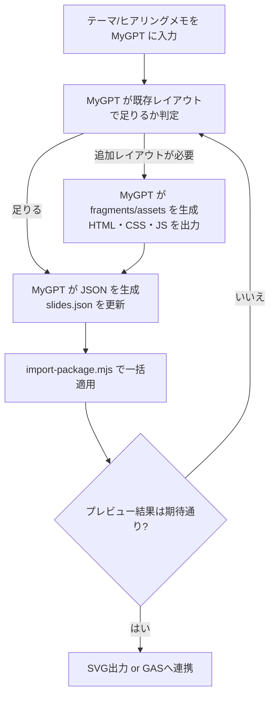

# Dual Style Slide Template

テンプレートHTML 1枚で華美/シンプル両対応のスライドを生成し、`slides.json` によるデータ流し込み・追加HTML/CSS/JSの読み込みでレイアウトや演出を自由に拡張できます。本ドキュメントは最新の拡張方式（`fragments` と `assets`）に沿って再構成しました。

## 1. アーキテクチャ概要
| レイヤ | ファイル/仕組み | 役割 |
| --- | --- | --- |
| ベーステンプレ | `public/slide_template/dual_style_slide_template.html` | data-ai-field を持つ既定スライド群。SVG出力/縮尺調整/テーマ切替ロジックを内包。 |
| データ | `public/slide_template/slides.json` | テキスト/HTML/attr 値、テーマ（`theme_variant`）、レイアウト差し替え（`fragments`）、追加CSS/JS（`assets`）を宣言。 |
| 追加HTML | `public/slide_template/fragments/*.html` | プロンプトB等で生成したスライド断片を配置。`fragments` 経由で自動読み込み。 |
| 追加CSS/JS | `public/slide_template/assets/*.css`, `public/slide_template/assets/*.js` | CSSで追加の配色/余白/アニメーションを、JSでインタラクションやカスタムチャート描画を定義。`slides.json.assets.styles / .scripts` の列挙順で読み込み。 |

## 2. クイックスタート
1. `public/slide_template` をホスト (例: `npx serve public/slide_template`). `file://` では fetch が制限されるため要注意。
2. `slides.json` を編集。最低限 `presentation_*` 系フィールドを更新し、必要なら `theme_variant` を `vibrant`/`minimal` で指定。
3. 追加レイアウトが必要になったら、プロンプトBに `div.slide-content` を生成させ `fragments/xxxx.html` に保存。
4. `slides.json` → `"fragments": { "overall-wrap": "fragments/xxxx.html" }` のように紐づけ。
5. CSS/JS が必要なら `assets/*.css|js` を作成し、`"assets": { "styles": ["assets/foo.css"], "scripts": ["assets/bar.js"] }` を追加。
6. ブラウザで `dual_style_slide_template.html` を開き内容を確認。SVG出力ボタンで各スライドをクリップボードorダウンロード。

## 3. slides.json の主キー
```json
{
  "theme_variant": "vibrant",
  "assets": {
    "styles": ["assets/sample_extra.css"],
    "scripts": ["assets/sample_extra.js"]
  },
  "fragments": {
    "overall-wrap": "fragments/sample_closing.html"
  },
  "presentation_title": "なぜ今、Palantir Technologies が注目されているのか"
  // ... data-ai-field と同名のフィールドが続く ...
}
```
- `theme_variant`: `vibrant`（華美/既定）か `minimal`（シンプル）。未指定なら `vibrant`。
- `assets.styles / assets.scripts`: 追加CSS/JSの相対パス（配列 or 文字列）。CSSは `<link rel="stylesheet">`、JSは `<script>` として順番通りに読み込み。
- `fragments`: key=スライドID (`data-slide-id`)、value=HTMLパス。ファイル内に `.slide-content` があれば置換、無ければ生成。
- それ以外のキーは `data-ai-field` と一致。値は文字列 or `{ "html": "...", "text": "...", "attributes": {...} }` を指定。

## 4. レイアウト差し替え (fragments)
1. プロンプトBへ「`overall-wrap` スライドの `div.slide-content` を生成して」と依頼。
2. 返ってきたHTMLを `public/slide_template/fragments/<任意>.html` に保存。
3. `slides.json.fragments` に `"overall-wrap": "fragments/<任意>.html"` を追加。
4. テンプレを読み込むと自動で fetch → `div.slide-content` を置き換え。
5. HTML内で使っている `data-ai-field` に対応する値を `slides.json` 側にも追加する。

### 参考: サンプル断片
`public/slide_template/fragments/sample_closing.html` は最小構成の例です。`slide-content` ごと差し替える場合の型として利用できます。

## 5. 追加CSS/JS (assets)
- CSS/JS を案件ごとに生成したい場合、`public/slide_template/assets/` 以下にファイルを置きます。
- 例: `assets/sample_extra.css` で `.infographic-frame.custom-accent` の色味を変更、`assets/sample_extra.js` で特定要素に属性付与。
- `slides.json.assets.styles` に `["assets/sample_extra.css"]`、`slides.json.assets.scripts` に `["assets/sample_extra.js"]` を書けば、自動で `<head>` / `<body>` に挿入されます。
- 読み込み順は配列順。JS は `async=false` で順次実行されるため、依存関係があれば配列順で制御可能です。

## 6. MyGPT向け推奨設定
| 項目 | 推奨設定 |
| --- | --- |
| 名前 | `Dual Style Slide Co-Pilot` |
| 説明 | `data-ai-field を鍵に JSON 差し替え・HTML断片・追加CSS/JSを自動適用するテンプレートです` |
| 指示 | 以下のマークダウンを MyGPT の Instructions に設定 |
| ナレッジ | `public/slide_template/dual_style_slide_template.html`、`public/slide_template/slides.json`（代表例）、`README.md` を Knowledge に登録しておくと MyGPT が構造やフィールド定義を参照しやすくなります。 |

```md
あなたは Dual Style Slide Template の共同制作者です。以下の手順で回答してください。

1. ゴールと必要スライドを確認し、既存テンプレのレイアウトでカバーできるかを MyGPT 自身が判断する。
2. レイアウトが足りると判断した場合は JSON を生成（プロンプトA相当）し、コピペ可能な `slides.json` を返す。
3. 追加レイアウトが必要と判断した場合は HTML/CSS/JS を生成（プロンプトB相当）し、`fragments/<name>.html`、`assets/*.css|js` へ保存できる形式で返す。
4. JSONの値は文字列または {"html"|"text"|"attributes"} 形式が使えること、数値/日付は単位付きで返すことを強調。
5. 新しい data-ai-field を追加したら、プロンプトAのJSONにも同じキーを含めるよう指示。
6. 生成後は `public/slide_template/slides.json` へ保存し、必要に応じて `window.SLIDE_DATA` や `data-slide-data` を更新するよう案内。
7. `theme_variant` で `vibrant`/`minimal` の切り替えができると説明し、案件トーンに合わせて設定。
8. プロンプトBで生成したHTMLは `slides.json.fragments` に登録すれば自動で読み込まれると伝える。
9. 追加CSS/JSが必要なら MyGPT にファイル内容を生成させ、`slides.json.assets.styles` / `.scripts` へストアするよう指示。
```

## 7. GAS連携 MyGPT（HTML → Googleスライド変換）
GAS向けの MyGPT 設定例は README 下部の表を参照してください。`slides.json` をそのままGASに読み込ませ、Google Slides へ描画するワークフローを想定しています。

## 8. 参考ワークフロー (mermaid)


## 9. テーマ指定 → 一括生成ワークフロー
プロンプトA/Bを別々に依頼する代わりに、テーマを渡すだけで **JSON・HTML・CSS・JS** をまとめて受け取り、自動で配置するフローを追加しました。

### 9.1 MyGPTへの統合プロンプト指示例
Instructions の末尾に次のルールを追記すると、MyGPTがファイル単位で出力してくれます。

```
与えられたテーマ/ターゲット/スライド構成を踏まえ、以下のコードブロックをこの順に出力してください。

1. ```file=public/slide_template/slides.json
   { JSON全文 }
   ```
2. 差し替えるスライドごとに
   ```file=public/slide_template/fragments/<slide-id>.html
   <div class="slide-content">...</div>
   ```
3. 追加CSSが必要であれば
   ```file=public/slide_template/assets/<name>.css
   /* CSS */
   ```
4. 追加JSが必要であれば
   ```file=public/slide_template/assets/<name>.js
   // JS
   ```
```

### 9.2 取り込みコマンド
MyGPTの応答を `packages/latest.txt` に保存し、プロジェクトルートで実行します。

```bash
node scripts/import-package.mjs packages/latest.txt
```

- `file=...` フェンスの中身が該当パスへ上書き保存されます。新しいディレクトリは自動作成されます。
- クリップボード内容を直接パイプしたい場合は `node scripts/import-package.mjs - < packages/latest.txt` のように `-` を指定します。
- 適用後は `git diff` で差分を確認し、期待どおりならブラウザで再読み込みしてください。

### 9.3 注意点
- MyGPTに余計なコードブロックを出さないよう、` ```file=...` フォーマットを厳守させてください。
- `slides.json` が丸ごと上書きされるため、既存内容を活かしたい場合は統合プロンプト内で「既存値も保持する」指示を追加します。
- fragments / assets を空にしたい場合は JSON から該当項目を削除すれば元のテンプレ構成へ戻せます。

## 10. FAQ
- **Q. `file://` で開くと fragments/assets が反映されない**  
  A. fetch がブロックされるため、`npx serve public/slide_template` などローカルサーバー経由で開いてください。
- **Q. 既存テンプレと互換性が崩れるのでは?**  
  A. fragments/assets は任意スライドに対する差し替え用途です。テンプレの骨組みは残るため、必要な範囲だけ壊して品質を優先できます。必要に応じて `fragments` を削除すれば元のレイアウトに戻せます。
- **Q. GAS連携時は fragments/assets も使える?**  
  A. そのままでは使えないため、GASへ渡す際はテンプレHTMLを最新の状態にビルドするか、fragments/assets を反映したスタンドアロンHTMLを用意してからスクリプトに渡してください。

---
以上が最新構成の README です。テンプレ、JSON、fragments、assets の4レイヤを意識してご利用ください。
