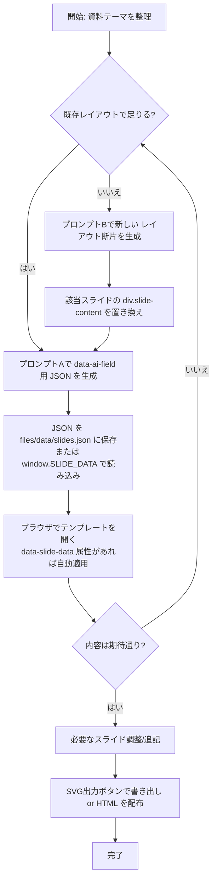

# slide_template

## 概要
`dual_style_slide_template.html` は、生成AIにコンテンツ作成を任せることを前提にしたHTML単一ファイルのスライドテンプレートです。華美な演出にも社内共有用のシンプルデザインにも対応し、必須スライドとクッションスライドを標準で備えています。

## ファイル構成
- `dual_style_slide_template.html`  
  タイトル → アジェンダ → クッション → 背景 → 目的 → クッション → サマリー → ロードマップ → ステークホルダー・ガント → 全体まとめ → 追加資料の順に並んだスライド群を収録しています。各コンテンツ差し替え箇所には `data-ai-field` 属性が付与されています。

## 使い方
1. テンプレートをブラウザで開きます。白基調のデザインで統一されており、全スライドを縦スクロールで一括確認できます。
2. 実際の資料構成に合わせて、不要なスライドは削除・順番変更・複製を行ってください。テンプレートのスライド順はあくまで推奨例であり、10枚・20枚といった任意の枚数へ柔軟に拡張できます。
3. 生成AIにはテンプレートをそのまま渡すのではなく、`data-ai-field` 名とセットで出力すべきコンテンツを JSON 形式で生成させます（後述のプロンプトAを参照）。生成結果は `public/data/slides.json` のように保存するか、`window.SLIDE_DATA = {...};` を読み込むスクリプトに記載します。
4. HTML 側では `<body data-slide-data="public/data/slides.json">` を指定するか、上記のように `window.SLIDE_DATA` を定義することでテンプレートへ自動反映できます。レイアウト変更が必要な場合のみ、プロンプトBで追加のHTML断片を生成し、該当スライドに差し替えます。
5. ブラウザでプレビューし、必要に応じてロードマップ／ステークホルダー・ガントなどの列数やタスク配置を調整したり補足スライド（appendix セクション）を複製して追記します。
6. 各スライド右上（スライド外）に表示される `SVG出力` ボタンから、その場でSVGをクリップボードへコピーできます。Clipboard API非対応環境では自動的にSVGファイルをダウンロードします。

### ワークフローの全体像

### 参考フォルダ構成（例）
```
project-root/
├─ public/
│  ├─ data/
│  │  └─ slides.json        # プロンプトAで生成したJSON
│  └─ slide_template/
│     ├─ dual_style_slide_template.html
│     ├─ styles.css         # （任意）外部化したCSS
│     └─ scripts.js         # （任意）外部化したJS
├─ scripts/
│  └─ inject-slide-data.mjs  # JSONをHTMLへ適用するビルドスクリプト（任意）
├─ README.md
└─ package.json（任意）
```
- `public/data/slides.json` を配信サーバや静的ホスティングに置く場合は、`<body data-slide-data="/data/slides.json">` のように相対パスで参照してください。
- ローカルで `window.SLIDE_DATA` を使う場合は、ビルド工程で JSON を読み込んで `scripts.js` 内に差し込む方法もあります。



### テンプレートで押さえているポイント
- スライド間の論理接続を保つため、アジェンダ切り替えや内容の飛躍を防ぐクッションスライドを配置。
- `chart-card`／`viz-card` には、絵文字・簡易SVG・表などで簡易チャート／ポンチ絵を実際に描き込めるスペースを確保。
- 主要カードには絵文字ベースのサンプルポンチ絵を初期配置しており、生成AIが表現形式を学習しやすくしています。
- 進捗報告・企画提案向けに、四半期×レーン単位で編集できるロードマップボードを追加。
- ロードマップと連動し、ステークホルダー別のタスク・連携先・時系列を矢羽つきガントチャート形式で俯瞰できるスライドを搭載。
- すべてのスライド右下に赤字の「CONFIDENTIAL」ラベルを表示し、秘匿資料であることを明確化。
- 各スライド右上の `SVGコピー` ボタンで、描画内容をそのままSVGとして取得（クリップボードまたはダウンロード）し、PowerPoint等へ貼り付け可能。
- 装飾用アイコンは可能な限り Unicode 16.0 / Emoji 16.0 準拠の絵文字で代用できるように設計しており、生成AIへも同方針を指示できます。
- 全スライドを縦に並べたビューのままレビューでき、上下移動に関する追加スクリプトは不要です。
- スライドセットはモジュール式で、アジェンダに応じて任意に追加・削除・順序変更しやすいレイアウトを想定しています。
- 各スライドにリード文スロットと次スライドへの橋渡し文を用意し、ストーリー展開を明示化。

### 用途別ヒント
- **調査結果の報告**: 背景スライドでファクトを整理し、ロードマップレーンを「施策」「リスク」「依存関係」などの観点に差し替えて進捗を可視化。
- **進捗報告・ステータス共有**: ロードマップの列ラベルを月／四半期／マイルストーンに変更し、セル内で完了状況や指標を整理。凡例エリアで進行中・遅延などの色分け指示を記入します。
- **企画提案**: クッションスライドで「現状→提案→効果」の流れを補強し、ロードマップには導入フェーズと成果計測フェーズを分けて描写すると検討の抜け漏れを防げます。

### ロードマップスライドの調整
- 列数を変えたい場合は `<div class="roadmap-board" style="--roadmap-columns: 4">` の数値を変更し、不要な列ブロックを削除または追加します。
- 行を増やす場合は `.roadmap-row` ブロックごと複製し、`roadmap_lane_X_*` の `data-ai-field` 名を連番で追加してください。
- AIに矢印やコネクタ、色分けの指示を出したいときは、各セルのテキスト内で「青矢印で依存関係」「赤枠で遅延リスク」と明記するとキャンバス上でも指示が残りやすくなります。
- 画像のような複雑なガント図を再現したい場合は、テンプレート内で構造を保ったままセルに「矩形を3段重ね」「矢印を折れ線で」など描画指示を書くことで、生成AIが図形配置の意図を理解しやすくなります。

### ステークホルダー・ガントの調整
- 列数を変更する場合は `<div class="stakeholder-gantt" style="--timeline-columns: 6">` の数値、および `.gantt-header` 内の列ヘッダ・`.gantt-guides` の `<span>` 数を揃えてください。
- 行を追加する際は `.gantt-row` ブロックを複製し、`stakeholder_lane_X_*` やタスク用フィールド名が重複しないよう番号を更新します。
- `gantt-task` 要素の `--start`（開始列）と `--end`（終了列）を調整してタスクの長さを指定します。`--task-color` を変えることでガントバーの色も切り替えられます。
- 各タスクには `gantt-task-title`／`gantt-task-body`／`gantt-task-links` を用いて内容・補足・連携先を記述し、必要に応じて追加のタスクブロックを挿入してください。
- `gantt-notes` や `gantt-legend` のフィールドに、矢印や色分けのルール、凡例をまとめると生成AIがビジュアル指示を理解しやすくなります。

### 生成AIに依頼する際の注意
- `data-ai-field` 属性の範囲のみを書き換え、HTML構造・クラス・コメントは保持させてください。
- テキストはビジネス用途を意識した自然な日本語で書き換えるよう指示します。

## 推奨プロンプト
以下を生成AIに渡すことで、テンプレートを意図通りに埋めてもらいやすくなります。

```text
あなたはエグゼクティブ向け資料を作成するアシスタントです。添付のHTMLテンプレートには data-ai-field 属性付きのプレースホルダがあり、必ずその範囲のみを書き換えてください。属性名はコンテンツの意味を示しています。

指示:
### 生成AIに依頼する際のワークフロー
- `data-ai-field` ごとのコンテンツは JSON で生成し、テンプレートへ差し込むのが基本です（プロンプトA）。
- レイアウト変更が必要なスライドのみ、差し替え用の HTML 断片を生成し、`data-ai-field` を付けた状態でテンプレートに組み込みます（プロンプトB）。
- JSON には文字列だけでなく `{"html": "...", "attributes": {...}}` のようなオブジェクトも指定できます。スクリプトが自動で `innerHTML` や属性を適用します。

## 推奨プロンプト

### A. スロット差し替え用 JSON を生成する
```text
あなたはエグゼクティブ向け資料を作成するアシスタントです。添付テンプレートの data-ai-field 一覧に従って、各フィールドへ差し込む内容を JSON 形式で出力してください。HTML の構造・クラスは変更しません。

条件:
- 余計な解説文は書かず、JSON オブジェクトのみを返す。
- 各値は文字列、もしくは { "html": "...", "text": "...", "attributes": {...} } 形式で指定する（html と text は必要な方だけで可）。
- 数値・日付は単位や注記を併記し、ポンチ絵では絵文字や記号で視覚指示を記載する。

出力フォーマット例:
```json
{
  "presentation_title": "2024年度CX変革キックオフ",
  "summary_lead": {
    "html": "<p>ここまでの議論から導かれる主要ポイントを整理。</p>"
  },
  "stakeholder_lane_2_task_1_links": {
    "text": "連携: 利用部門 / ベンダー"
  }
}
```
```

### B. レイアウト変更用の HTML 断片を生成する
```text
あなたはプレゼン資料用のHTMLセクションをデザインするアシスタントです。指定したスライドIDの `div.slide-content` 内部を差し替えるHTMLを出力してください。

条件:
- Tailwindユーティリティの使用は許可するが、既存テーマのタイポグラフィと余白に沿うこと。
- 生成するHTML内のテキスト要素には必ず data-ai-field を付与し、JSON差し替えができるようにする。
- 出力はHTMLコードのみ（説明文や追加コメントは禁止）。
```

新しい `data-ai-field` を追加した場合は、プロンプトAで出力する JSON にも同じキーを含めてください。

## GAS連携プロンプト（HTML→Googleスライド変換用）
Gemini/ChatGPTに以下のプロンプトを渡すことで、テンプレートHTMLからGoogleスライドを生成するGASコードを出力させることができます。必要に応じてプレゼンテーションの内容を編集したHTMLを添付し、このプロンプトでスクリプト生成を依頼してください。

```text
# 命令
あなたは HTML でデザインされたスライドを Google スライドへ変換することを専門とする熟練の Google Apps Script 開発者です。これから渡す HTML テンプレートは `div.slide-container > section.slide[data-slide-id="..."]` という構造で 1 枚のスライドを表現しており、各スライドの外側には SVG コピー用ボタンなどの補助UIが含まれます。**実際にレイアウトへ反映すべき要素は section.slide 内のみ**であり、補助UIは無視してください。

提供された HTML を分析し、**データとロジックの厳密な分離**という設計原則を守りながら、Google スライド（16:9）を自動生成する GAS を単一のコードブロックで出力してください。作成するスクリプトでは以下を必ず満たします。

- レイアウト・テキスト・配色・太字などを可能な限り忠実に再現し、スライド幅・高さを Slides API から取得して相対位置（%）を pt へ変換して配置する。
- スライドごとのデータ（背景色、テキスト、図形、色など）は `getLayoutData()` の返り値となる JSON 風配列に定義し、ロジック側から参照するだけにする。
- 特定の要素で描画に失敗しても処理全体は止まらず、可能な範囲までスライド生成を続行し、エラー内容をログに残して完走させる。
- 右下の赤文字 `CONFIDENTIAL` や SVG コピー用ボタンなどテンプレート固有の補助 UI はスライド化しない。

# 達成目標
1. **デザインの忠実な再現** – HTML 内のレイアウト・タイポグラフィ・カラーリングを 16:9 スライド上で再現する。必要に応じて SHAPE を合成してグラデーションや背景カードを表現する。
2. **高いメンテナンス性** – テキストや色の変更が `getLayoutData()` のデータ編集だけで完結し、描画ロジックは変更不要である状態を保つ。
3. **エラー耐性** – 個々の要素描画失敗では処理を継続し、全体 fatal error 時のみアラートを出す堅牢なコードを作成する。

# 実行手順
生成する GAS は以下 2 関数のみで構成し、**createSlides() を先頭に配置**してください。

## 1. createSlides() 関数（ロジック層）
最初に以下のコードを **一字一句変更せず** スクリプトの先頭へ記述してください。`getLayoutData()` から相対座標（0–100%）およびメタデータを取得し、Slides API へ描画するエンジンです。

/** ... 省略せずに提示された createSlides() コード全文 ... */

## 2. getLayoutData() 関数（データ層）
次に、HTML の視覚構造を読み解いて作成したレイアウト定義を返す `getLayoutData()` を実装します。

- 各 `section.slide` を 1 枚のスライドとして `backgroundColor`（16進カラー）と `elements` 配列を定義する。
- `elements` 内は **背景（type:'SHAPE'）→テキスト（type:'TEXT'）の順**で並べる。重なり順序を意識し、背景カードはテキストより先に記述する。
- `SHAPE` 要素は `left/top/width/height` を 0–100% で記述し、必要に応じて `shapeColor` を指定する。
- `TEXT` 要素は `text`（改行は \n）、`fontSize`（pt）、`color`、`bold`、`alignment`（SlidesApp.ParagraphAlignment.*）を設定する。フォントは `'Noto Sans JP'` を使用し、必要に応じて調整可。
- HTML のどの要素から変換したのかが分かるように **日本語コメント** を添えてください。
- `.svg-copy` ボタンやクッションコメント等、テンプレートの補助要素はデータに含めない。

# 出力形式
1. `createSlides()`（変更不可）と `getLayoutData()` の 2 関数のみを含む GAS コードを 1 つのコードブロックで出力する。
2. `getLayoutData()` 内のコメントで、各要素が HTML のどの部分に対応するか説明する。
3. 取得したスタイルやコンテンツを固定値としてデータ化し、ロジック層で条件分岐やハードコードを行わない。

以上の指示に厳密に従って GAS コードを生成してください。
```
