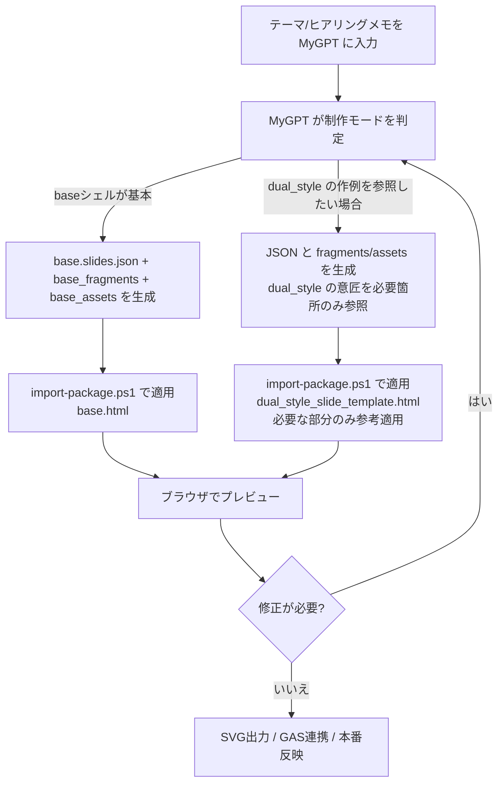
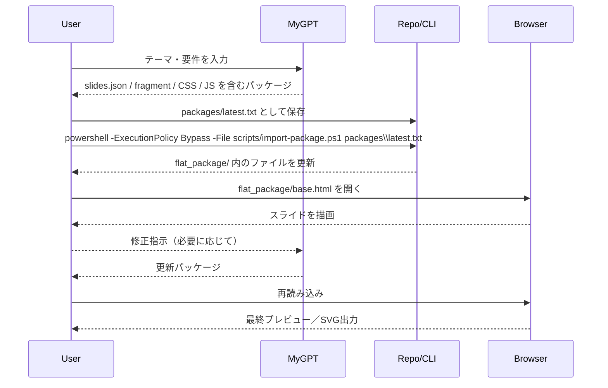

# Dual Style Slide Template

テンプレートHTML 1枚で華美/シンプル両対応のスライドを生成し、`slides.json` によるデータ流し込み・追加HTML/CSS/JSの読み込みでレイアウトや演出を自由に拡張できます。本ドキュメントは最新の拡張方式（`fragments` と `assets`）に沿って再構成しました。さらに、完全に白紙状態から構築したい場合に備え、最小構成の `base.html` も用意しています。

## 0. base.html（極小シェル）
| ファイル | 説明 |
| --- | --- |
| `flat_package/base.html` | スライド容器・タイトル/リード表示・SVGダウンロードボタンのみを備えたシェル。`data-slide-data="slides.json"` をデフォルト参照。 |
| `flat_package/slides.json.sample` | `assets.styles/scripts` と `slides` 配列（`id`/`title`/`lead`/`fragment`）のみを定義。テーマごとに MyGPT から丸ごと生成する想定。 |
| `flat_package/fragment_*.html`, `flat_package/style_*.css`, `flat_package/script_*.js` | ChatGPT などが生成したコンテンツ/スタイル/動作を格納。すべて同一フォルダに置くことで初心者でも管理しやすくしています。 |
| `flat_package/fragment_intro.html` | サンプルの差し替え用HTML。`slides.json` で `"fragment": "fragment_intro.html"` のように参照。 |
| `flat_package/style_extra.css` | サンプルの追加CSS。配色や余白調整を記述。`slides.json.assets.styles` に列挙。 |
| `flat_package/style_extra.css` | サンプルの追加CSS。配色や余白調整を記述。`slides.json.assets.styles` に列挙。 |
| `flat_package/script_extra.js` | サンプルの追加JS。簡易的なインタラクションを記述。`slides.json.assets.scripts` に列挙。 |

**使い方の流れ**
1. テーマや要件を MyGPT に渡し、`flat_package/slides.json.sample` の中身・`flat_package/fragment*.html`・`flat_package/style*.css|script*.js` をまとめて生成させる（9章の統合プロンプト参照）。
2. 出力は Windows の場合 `powershell -ExecutionPolicy Bypass -File scripts/import-package.ps1 packages\latest.txt` で配置。`flat_package/slides.json.sample` を上書きし、必要な fragment/asset ファイルが作成される。
3. `flat_package/base.html` をブラウザで開くと、最小シェルに読み込まれた HTML/CSS/JS がそのまま描画される。テンプレ互換は気にせず品質優先で制作したい場合はこちらを利用してください。

以降の章では、従来の `public/slide_template/dual_style_slide_template.html` を「参考レイアウト／過去資産」として扱うフローをまとめています。最終成果物は base.html で自由に構成し、dual_style に関する記述は**あくまで作成例**として読み替えてください。

## 1. アーキテクチャ概要
| レイヤ | ファイル/仕組み | 役割 |
| --- | --- | --- |
| ベーステンプレ | `public/slide_template/dual_style_slide_template.html` | data-ai-field を持つ既定スライド群。SVG出力/縮尺調整/テーマ切替ロジックを内包。 |
| データ | `public/slide_template/slides.json` | テキスト/HTML/attr 値、テーマ（`theme_variant`）、レイアウト差し替え（`fragments`）、追加CSS/JS（`assets`）を宣言。 |
| 追加HTML | `public/slide_template/fragments/*.html` | プロンプトB等で生成したスライド断片を配置。`fragments` 経由で自動読み込み。 |
| 追加CSS/JS | `public/slide_template/assets/*.css`, `public/slide_template/assets/*.js` | CSSで追加の配色/余白/アニメーションを、JSでインタラクションやカスタムチャート描画を定義。`slides.json.assets.styles / .scripts` の列挙順で読み込み。 |

## 2. クイックスタート
1. `public/slide_template` をホスト (例: `npx serve public/slide_template`). `file://` では fetch が制限されるため要注意。
2. `slides.json` を編集。最低限 `presentation_*` 系フィールドを更新し、必要なら `theme_variant` を `vibrant`/`minimal` で指定。
3. 追加レイアウトが必要になったら、プロンプトBに `div.slide-content` を生成させ `fragments/xxxx.html` に保存。
4. `slides.json` → `"fragments": { "overall-wrap": "fragments/xxxx.html" }` のように紐づけ。
5. CSS/JS が必要なら `assets/*.css|js` を作成し、`"assets": { "styles": ["assets/foo.css"], "scripts": ["assets/bar.js"] }` を追加。
6. ブラウザで `dual_style_slide_template.html` を開き内容を確認。SVG出力ボタンで各スライドをクリップボードorダウンロード。

## 3. slides.json の主キー
```json
{
  "theme_variant": "vibrant",
  "assets": {
    "styles": ["assets/sample_extra.css"],
    "scripts": ["assets/sample_extra.js"]
  },
  "fragments": {
    "overall-wrap": "fragments/sample_closing.html"
  },
  "presentation_title": "なぜ今、Palantir Technologies が注目されているのか"
  // ... data-ai-field と同名のフィールドが続く ...
}
```
- `theme_variant`: `vibrant`（華美/既定）か `minimal`（シンプル）。未指定なら `vibrant`。
- `assets.styles / assets.scripts`: 追加CSS/JSの相対パス（配列 or 文字列）。CSSは `<link rel="stylesheet">`、JSは `<script>` として順番通りに読み込み。
- `fragments`: key=スライドID (`data-slide-id`)、value=HTMLパス。ファイル内に `.slide-content` があれば置換、無ければ生成。
- それ以外のキーは `data-ai-field` と一致。値は文字列 or `{ "html": "...", "text": "...", "attributes": {...} }` を指定。

## 4. レイアウト差し替え (fragments)
1. プロンプトBへ「`overall-wrap` スライドの `div.slide-content` を生成して」と依頼。
2. 返ってきたHTMLを `public/slide_template/fragments/<任意>.html` に保存。
3. `slides.json.fragments` に `"overall-wrap": "fragments/<任意>.html"` を追加。
4. テンプレを読み込むと自動で fetch → `div.slide-content` を置き換え。
5. HTML内で使っている `data-ai-field` に対応する値を `slides.json` 側にも追加する。

### 参考: サンプル断片
`public/slide_template/fragments/sample_closing.html` は最小構成の例です。`slide-content` ごと差し替える場合の型として利用できます。

## 5. 追加CSS/JS (assets)
- CSS/JS を案件ごとに生成したい場合、`public/slide_template/assets/` 以下にファイルを置きます。
- 例: `assets/sample_extra.css` で `.infographic-frame.custom-accent` の色味を変更、`assets/sample_extra.js` で特定要素に属性付与。
- `slides.json.assets.styles` に `["assets/sample_extra.css"]`、`slides.json.assets.scripts` に `["assets/sample_extra.js"]` を書けば、自動で `<head>` / `<body>` に挿入されます。
- 読み込み順は配列順。JS は `async=false` で順次実行されるため、依存関係があれば配列順で制御可能です。

## 6. MyGPT向け推奨設定
| 項目 | 推奨設定 |
| --- | --- |
| 名前 | `Dual Style Slide Co-Pilot` |
| 説明 | `data-ai-field を鍵に JSON 差し替え・HTML断片・追加CSS/JSを自動適用するテンプレートです` |
| 指示 | 以下のマークダウンを MyGPT の Instructions に設定 |
| ナレッジ | `flat_package/base.html`、`flat_package/slides.json.sample`、`flat_package/fragment_intro.html`（サンプル）、`flat_package/style_extra.css`、`flat_package/script_extra.js`、`public/slide_template/dual_style_slide_template.html`（参考レイアウト）、`public/slide_template/slides.json.sample`（代表例）、`README.md` を Knowledge に登録すると、MyGPT が呼び出し元の構造や期待するフィールドを把握しやすくなります。 |

```md
あなたは Dual Style Slide Template の共同制作者です。以下の手順で回答してください。

1. ゴールと必要スライドを確認し、まずは `flat_package/base.html` を前提に JSON / fragments / CSS / JS を丸ごと生成する計画を立てる。必要があれば dual_style のレイアウトを参考として提案するが、基本は base シェルで完結させる。
2. 出力は必ず `flat_package/slides.json.sample` をベースにした JSON を提示し、`slides` 配列／`assets.styles`／`assets.scripts`／`fragments` をテーマに沿って更新する。既存 data-ai-field を流用する場合は同名キーを忘れずに含める。
3. スライド単位で HTML が必要な場合は `flat_package/fragment_<id>.html` に保存できる形で生成し、必要に応じて `flat_package/style_extra.css` や `flat_package/script_extra.js` へ追記するコードも提示する。コードブロックは ` ```file=...` フォーマットで返す。
4. JSONの値は文字列または {"html"|"text"|"attributes"} 形式が使えること、数値/日付は単位付きで返すことを強調。
5. dual_style テンプレートを参考にする場合は、どのスライドを引用したかをコメントで示し、必要最小限の fragments/assets を `public/slide_template` 配下に出力する。
6. 生成後は `flat_package/slides.json` を上書きし、PowerShell スクリプト（または手動手順）でパッケージを適用できるよう案内する。
7. `theme_variant` を `vibrant`/`minimal` から選んで JSON に含め、案件トーンに合わせて設定。
8. 追加CSS/JSを生成した場合は `assets.styles` / `assets.scripts` にファイル名を列挙することをリマインドする。
```

## 7. GAS連携 MyGPT（HTML → Googleスライド変換）
`slides.json` をそのまま Apps Script に読み込ませ、Google Slides へ描画するワークフローを想定しています。MyGPT 側での推奨設定は次の通りです。

| 項目 | 設定例 |
| --- | --- |
| 名前 | `Dual Slide → Google Slides Builder` |
| 説明 | `flat_package や dual_style で生成された HTML/JSON を解析し、Apps Script で Google スライドへ変換するエンジニアとして振る舞います。` |
| ナレッジ | `flat_package/base.html`, `flat_package/slides.json.sample`, `public/slide_template/dual_style_slide_template.html`, `public/slide_template/slides.json`, `README.md` を登録すると変換元の構造が参照しやすくなります。 |

**Instructions（MyGPTへ貼り付け）**

```md
あなたは Google Apps Script を用いて HTML スライドを Google スライドに変換するエンジニアです。以下の手順で回答してください。

1. 利用者が `flat_package/base.html`、`flat_package/slides.json.sample`（または `public/slide_template/dual_style_slide_template.html` ＋ `slides.json`）を添付しているか確認し、不足があれば依頼する。
2. 添付HTML/JSONを解析し、必要なレイアウト（テキストボックス、図形、画像）を箇条書きで計画する。
3. Apps Script を提示する際は、設定部（Slide IDやDriveパス）、データロード部（JSON取得）、描画部（スライド生成）を関数で分割する。
4. `SlidesApp` もしくは Advanced Slides API のどちらを使うか明記し、data-ai-field 名とGoogleスライド上の要素をコメントで紐付ける。
5. 実行手順（GoogleスライドIDの設定、権限承認、再実行方法）とデバッグポイントを最後にまとめる。
```

## 8. 参考ワークフロー (mermaid)
dual_style 系のステップは「こういう作成例もある」という位置づけで、採用を前提としていません。必要に応じて base.html を軸とした自由な構成を優先してください。


## 9. テーマ指定 → 一括生成ワークフロー
プロンプトA/Bを別々に依頼する代わりに、テーマを渡すだけで **JSON・HTML・CSS・JS** をまとめて受け取り、自動で配置するフローを追加しました。

### 9.1 MyGPTへの統合プロンプト指示例
Instructions の末尾に次のルールを追記すると、MyGPTがファイル単位で出力してくれます。

与えられたテーマ/ターゲット/スライド構成を踏まえ、以下のコードブロックをこの順に出力してください。

1. slides.json 全文:
   ````text
   ```file=public/slide_template/slides.json
   { JSON全文 }
   ```
   ````
2. 差し替える各スライドの HTML:
   ````text
   ```file=public/slide_template/fragments/<slide-id>.html
   <div class="slide-content">...</div>
   ```
   ````
3. 追加CSSがあれば:
   ````text
   ```file=public/slide_template/assets/<name>.css
   /* CSS */
   ```
   ````
4. 追加JSがあれば:
   ````text
   ```file=public/slide_template/assets/<name>.js
   // JS
   ```
   ````

### 9.2 取り込みコマンド
MyGPTの応答を `packages\latest.txt` に保存し、プロジェクトルートで次を実行します（Windows標準の PowerShell のみで可）。

```powershell
powershell -ExecutionPolicy Bypass -File scripts\import-package.ps1 packages\latest.txt
```

- `file=...` フェンスの中身が該当パスへ上書き保存されます。新しいディレクトリは自動作成されます。
- 他のファイル名でもOKです。引数を変えるだけで使えます。
- 適用後は `git diff` で差分を確認し、期待どおりならブラウザで再読み込みしてください。

### 9.3 手動で適用する場合
PowerShellを使えない/使いたくない場合は、以下の手順で同じ結果を得られます。

1. MyGPTの応答から ` ```file=...` ブロックを1つずつ探す。
2. `file=...` のパスに該当するファイルを（必要ならフォルダも）手動で作成。
3. ブロック内の内容をそのまま貼り付けて保存（UTF-8 推奨）。
4. すべてのファイルを書き終えたらブラウザで再読み込みし、差分を確認。

ブロックが多い場合は PowerShell スクリプトを使う方が早いですが、最小環境しかない場合でも上記の方法で対応できます。

### 9.4 注意点
- MyGPTに余計なコードブロックを出さないよう、` ```file=...` フォーマットを厳守させてください。
- `slides.json` が丸ごと上書きされるため、既存内容を活かしたい場合は統合プロンプト内で「既存値も保持する」指示を追加します。
- fragments / assets を空にしたい場合は JSON から該当項目を削除すれば元のテンプレ構成へ戻せます。

## 10. 利用シーケンス例 (Mermaid)


## 10. FAQ
- **Q. `file://` で開くと fragments/assets が反映されない**  
  A. fetch がブロックされるため、`npx serve public/slide_template` などローカルサーバー経由で開いてください。
- **Q. 既存テンプレと互換性が崩れるのでは?**  
  A. fragments/assets は任意スライドに対する差し替え用途です。テンプレの骨組みは残るため、必要な範囲だけ壊して品質を優先できます。必要に応じて `fragments` を削除すれば元のレイアウトに戻せます。
- **Q. GAS連携時は fragments/assets も使える?**  
  A. そのままでは使えないため、GASへ渡す際はテンプレHTMLを最新の状態にビルドするか、fragments/assets を反映したスタンドアロンHTMLを用意してからスクリプトに渡してください。

---
以上が最新構成の README です。テンプレ、JSON、fragments、assets の4レイヤを意識してご利用ください。
