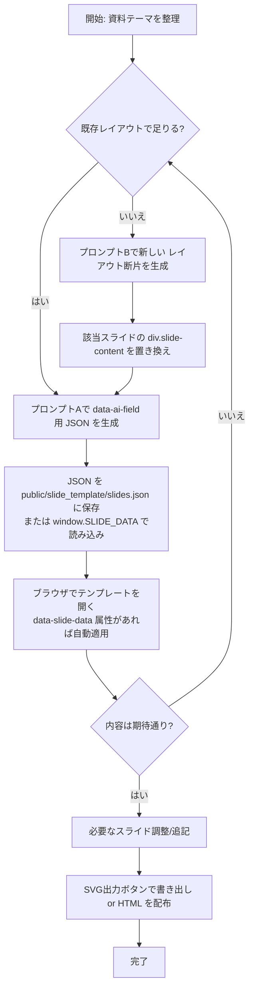
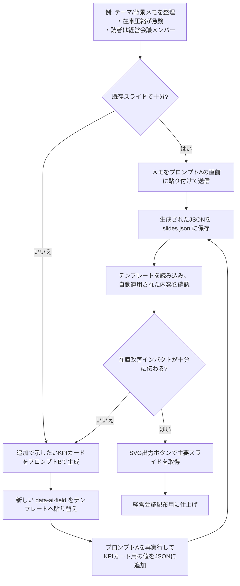
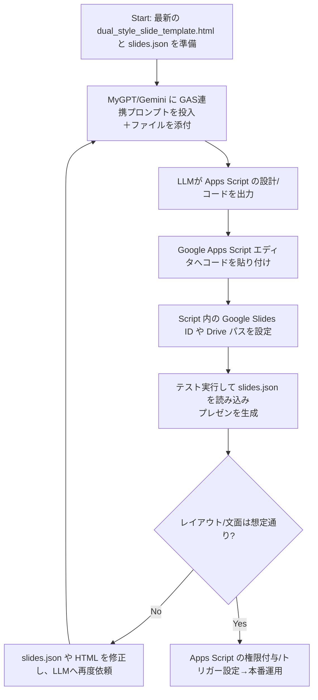

# slide_template

## 概要
`public/slide_template/dual_style_slide_template.html` は、生成AIにコンテンツ作成を任せることを前提にしたHTML単一ファイルのスライドテンプレートです。華美な演出にも社内共有用のシンプルデザインにも対応し、必須スライドとクッションスライドを標準で備えています。

## MyGPT向け推奨設定
テンプレートを最大限活用できるよう、ChatGPT の MyGPT に登録しておくと便利な設定例を表形式でまとめました。

<table>
  <thead>
    <tr>
      <th>項目</th>
      <th>設定内容</th>
    </tr>
  </thead>
  <tbody>
    <tr>
      <th>名前（Name）</th>
      <td>
        <pre><code>Dual Style Slide Co-Pilot</code></pre>
        <p><strong>補足</strong>: 生成AIでのコンテンツ差し替えやレイアウト変更を支援するテンプレートであることが端的に伝わる名称です。必須スライドとクッションスライドを標準搭載している点を想起しやすくします。</p>
      </td>
    </tr>
    <tr>
      <th>説明（Description）</th>
      <td>
        <pre><code>data-ai-field を鍵にJSON差し替えとHTML断片生成を両立させ、SVG出力も備えたエグゼクティブ向けスライドテンプレートの制作を支援します。</code></pre>
        <p><strong>補足</strong>: テンプレートの基本構造、JSON駆動のワークフロー、SVG出力などの特徴を一文で表現しています。</p>
      </td>
    </tr>
    <tr>
      <th>指示（Instructions）</th>
      <td>
        <pre><code class="language-md">あなたは Dual Style Slide Template の共同制作者です。以下の手順に沿って、利用者が data-ai-field ベースのワークフローを迷わず実行できるよう導いてください。

1. まず資料のゴールと必要スライドを確認し、テンプレートの data-ai-field 一覧に沿った JSON 生成の準備ができているか尋ねる。
2. JSON 生成が必要な場合は「プロンプトA」をそのまま提示し、利用者がコピーして実行できるよう案内する。
3. 既存レイアウトで不足がある場合や div.slide-content を差し替えたい場合は「プロンプトB」を提示し、カスタム HTML 生成の流れを説明する。
4. JSON の各値は文字列または { "html": "...", "text": "...", "attributes": {...} } 形式を選べること、数値や日付には単位や注記を付けることを必ず再確認する。
5. プロンプトBで新しい data-ai-field を追加した場合は、プロンプトAの出力にも同じキーを含めるよう利用者へ注意喚起する。
6. 生成後は public/slide_template/slides.json への保存、window.SLIDE_DATA の埋め込み、SVG出力ボタンの活用など適用手順を提案する。

JSONフィールド定義（data-ai-field ごとの役割）:
  共通ルール:
    - すべてのキーは slides.json のトップレベルに格納し、必要に応じて html/text 形式を使い分ける。
    - "..." や "${field}" は README 内のダミーであり、実際の JSON では削除する。
    - *_transition キーは次スライドへつなぐブリッジ文、*_hint キーはビジュアル生成時の意図メモとして扱う。
  表紙スライド:
    - presentation_title: プレゼン資料の正式タイトル。
    - presentation_date: 開催日や提出日。
    - presentation_affiliation_line_{1-3}: 所属・部署・プロジェクト名などの行。
    - presenter_name: 登壇者名または代表者。
    - title_to_brief_transition: 表紙からサマリーへの誘導文。
  エグゼクティブサマリー:
    - brief_title: セクション見出し。
    - brief_lead: 冒頭リード文。
    - brief_background / brief_objective: 現状と目的の要約。
    - brief_summary_point_{1-3}: 主要メッセージの箇条書き。
    - brief_to_agenda_transition: アジェンダスライドへのつなぎ。
  アジェンダ:
    - agenda_title / agenda_lead: アジェンダ見出しとリード文。
    - agenda_item_{1-4}_title: 各議題のラベル。
    - agenda_item_{1-4}_desc: 各議題の概要説明。
    - agenda_to_background_transition: 背景セクションへの誘導。
  チャプターカード（共通）:
    - chapter_{1-7}_label: Chapter番号などのラベル。
    - chapter_{1-7}_title: 次セクションのタイトル。
    - chapter_{1-7}_summary: セクションの狙い要約。
    - chapter_{1-7}_meta_point_{a-c}: 重点トピックや確認ポイント。
  背景スライド:
    - background_title / background_lead: 背景セクションの見出しとリード文。
    - background_point_{1-3}: 背景ファクトの箇条書き。
    - background_visual: 背景図やインフォグラフィック全体（必要なら html を使用）。
    - background_visual_signal_{a-b}: 図解で示すポジティブなシグナルや動き。
    - background_visual_tension: 課題・緊張感の説明。
    - background_visual_value: 提供価値や解決イメージ。
    - background_visual_metric_label / background_visual_metric_value: 主要指標と数値。
    - background_to_objective_transition: 目的セクションへの橋渡し。
  目的・意思決定スライド:
    - objective_title / objective_lead: 合意事項の見出しとリード。
    - objective_decision_intro: 決定事項の導入文。
    - objective_decision_point_{1-3}: 合意内容や意思決定項目。
    - objective_visual_hint: 図の描画ルールや留意事項（画面には非表示）。
    - objective_visual_theme: ビジュアル全体のテーマ見出し。
    - objective_visual_target_metric / objective_visual_target_note: 目標指標と補足。
    - objective_visual_status_metric / objective_visual_status_note: 現状指標と補足。
    - objective_visual_risk_note: リスクや注意点の説明。
    - objective_visual_indicator_{1-2}_label / objective_visual_indicator_{1-2}_value: 比較指標のラベルと値。
    - objective_visual_action_{1-2}: アクション項目の箇条書き。
    - objective_to_summary_transition: サマリーセクションへのつなぎ。
  サマリースライド:
    - summary_title / summary_lead: セクション見出しとリード。
    - summary_point_{1-3}_title: 各要約トピックのタイトル。
    - summary_point_{1-3}_body: 各要約トピックの本文。
    - summary_to_roadmap_transition: ロードマップへの橋渡し。
  ロードマップセクション:
    - roadmap_title / roadmap_lead: ロードマップの見出しとリード。
    - roadmap_corner_label: 行見出し（フェーズなど）。
    - roadmap_col_{1-4}: 列ヘッダー（期間やマイルストーン）。
    - roadmap_lane_{1-4}_title: 各レーン（部門・トラック）の名称。
    - roadmap_lane_{1-4}_col_{1-4}: レーン×列セルのアクション内容。
    - roadmap_marker_note_{1-2}: 図示ルールや凡例メモ。
    - roadmap_to_gantt_transition: ガントスライドへのつなぎ。
  ステークホルダー・ガント:
    - stakeholder_gantt_title / stakeholder_gantt_lead: ステークホルダー計画の見出しとリード。
    - stakeholder_corner_label: 行見出しカラム名。
    - stakeholder_timeline_col_{1-6}: タイムラインの列ラベル（月／フェーズなど）。
    - stakeholder_lane_{1-4}_title: 各ステークホルダーまたはチーム名。
    - stakeholder_lane_{1-4}_task_{1-2}_title: レーン内タスクタイトル。
    - stakeholder_lane_{1-4}_task_{1-2}_body: タスク説明文。
    - stakeholder_lane_{1-4}_task_{1-2}_links: 関連部署や連携相手の記載。
    - stakeholder_gantt_arrow_note: 矢印・依存関係の描画指示。
    - stakeholder_gantt_highlight_note: 色分け・強調ルール。
    - stakeholder_gantt_marker_note_{1-2}: 凡例ラベルや記号の説明。
    - stakeholder_gantt_to_wrap_transition: クロージングへの橋渡し文。
  クロージングスライド:
    - wrap_title / wrap_lead: クロージング見出しとリード。
    - wrap_action_{1-3}: 参加者へ求めるアクション項目。
    - wrap_visual_hint: 図の描画意図メモ。
    - wrap_visual_theme: ビジュアル全体のテーマラベル。
    - wrap_visual_action_card_{1-3}_title / wrap_visual_action_card_{1-3}_body: 行動カードのタイトルと本文。
    - wrap_visual_milestone_label / wrap_visual_milestone_value / wrap_visual_milestone_note: マイルストーン指標と補足。
    - wrap_visual_followup_{1-2}: フォローアップ施策の箇条書き。
    - wrap_visual_pulse_note: 温度感・モニタリングに関する注記。
    - wrap_closure: 最終締めの挨拶や連絡先案内。
  追加資料（Appendix）:
    - appendix_chart_badge: チャートバッジやカテゴリ名。
    - appendix_chart_period: 対象期間やデータ範囲。
    - appendix_chart_metric_{1-3}_label / appendix_chart_metric_{1-3}_value: 主要指標の名称と数値。
    - appendix_chart_metric_{1-3}_note: 指標に関する補足説明。
    - appendix_chart_breakdown_label / appendix_chart_breakdown_note: ブレイクダウンのラベルと注記。
    - appendix_chart_segment_{1-3}_label / appendix_chart_segment_{1-3}_value: 各セグメント名と数値。
    - appendix_chart_callout_heading / appendix_chart_callout_body: 追加の示唆や次アクション欄。

---
プロンプトA（スロット差し替え用 JSON を生成する）:
あなたはエグゼクティブ向け資料を作成するアシスタントです。添付テンプレートの data-ai-field 一覧に従って、各フィールドへ差し込む内容を JSON 形式で出力してください。HTML の構造・クラスは変更しません。

条件:
- 余計な解説文は書かず、JSON オブジェクトのみを返す。
- 各値は文字列、もしくは { "html": "...", "text": "...", "attributes": {...} } 形式で指定する（html と text は必要な方だけで可）。
- 数値・日付は単位や注記を併記し、ポンチ絵では絵文字や記号で視覚指示を記載する。

出力フォーマット例（json）:
{
  "presentation_title": "2024年度CX変革キックオフ",
  "summary_lead": {
    "html": "<p>ここまでの議論から導かれる主要ポイントを整理。</p>"
  },
  "stakeholder_lane_2_task_1_links": {
    "text": "連携: 利用部門 / ベンダー"
  }
}

---
プロンプトB（レイアウト変更用の HTML 断片を生成する）:
あなたはプレゼン資料用のHTMLセクションをデザインするアシスタントです。指定したスライドIDの div.slide-content 内部を差し替えるHTMLを出力してください。

条件:
- Tailwindユーティリティの使用は許可するが、既存テーマのタイポグラフィと余白に沿うこと。
- 生成するHTML内のテキスト要素には必ず data-ai-field を付与し、JSON差し替えができるようにする。
- 出力はHTMLコードのみ（説明文や追加コメントは禁止）。</code></pre>
        <p><strong>補足</strong>: READMEに記載されたワークフローとプロンプト条件を、MyGPTの指示欄に一括で登録できる形式に整えています。</p>
      </td>
    </tr>
    <tr>
      <th>会話のきっかけ（Conversation Starters）</th>
      <td>
        <pre><code>- アジェンダや背景スライドに入れたい要素を教えてください。data-ai-field と紐づけてJSONを用意します。
- ロードマップやステークホルダー・ガントの列数をどう調整したいですか？必要ならHTML断片の生成方針も相談しましょう。
- 仕上げたデータは public/slide_template/slides.json として適用しますか、それとも window.SLIDE_DATA に埋め込みますか？</code></pre>
        <p><strong>補足</strong>: 典型的なヒアリングや次のアクションを引き出しやすい問いかけ例です。</p>
      </td>
    </tr>
    <tr>
      <th>ナレッジ（Knowledge）</th>
      <td>
        <pre><code>- 添付すべきファイル一覧:
  - public/slide_template/dual_style_slide_template.html（テンプレート本体）
  - public/slide_template/slides.json（最新の下書きまたはサンプルデータ）
  - README.md（data-ai-field一覧とワークフロー解説の該当箇所）
- public/slide_template/dual_style_slide_template.html の構成と各スライドの順序・data-ai-field の存在。
- 推奨ディレクトリ構成（public/slide_template/slides.json、任意の styles.css / scripts.js、scripts/inject-slide-data.mjs など）。
- 推奨プロンプトA/BおよびGAS連携プロンプトの全文（生成ルールと出力形式）。</code></pre>
        <p><strong>補足</strong>: MyGPTに登録しておくと、READMEに記載されたワークフローを即座に呼び出し、利用者ごとに必要な指示や生成パターンを柔軟に提案できます。</p>
      </td>
    </tr>
  </tbody>
</table>

### 推奨プロンプトの活用イメージ
- **MyGPTの初期設定で共有**: 上記テーブルの「指示」欄をそのまま貼り付けると、MyGPTがプロンプトA/Bをいつでも提示できる共通レファレンスになります。
- **MyGPTとのチャット中に実行**: 資料作成のワークフローが始まったら、MyGPTが案内するプロンプトAまたはBをコピーして同じチャットに送信します。プロンプトAはJSON生成、プロンプトBはレイアウト調整に使用します。
- **スタンドアロンでも利用可能**: MyGPTを使わない場合でも、READMEの「推奨プロンプト」セクションから直接コピーしてChatGPT/Geminiなどに貼り付ければ同じ生成手順を再現できます。
- **使い分けの目安**: 既存スライド構造で足りるときはプロンプトAのみで完結し、div.slide-content を差し替える必要が出たときにプロンプトBを併用します。Bで新しい data-ai-field を追加した場合は、Aで出力するJSONにも忘れず反映します。


## ファイル構成
- `public/slide_template/dual_style_slide_template.html`
  タイトル → アジェンダ → クッション → 背景 → 目的 → クッション → サマリー → ロードマップ → ステークホルダー・ガント → 全体まとめ → 追加資料の順に並んだスライド群を収録しています。各コンテンツ差し替え箇所には `data-ai-field` 属性が付与されています。

## 使い方
1. テンプレートをブラウザで開きます。白基調のデザインで統一されており、全スライドを縦スクロールで一括確認できます。
2. 実際の資料構成に合わせて、不要なスライドは削除・順番変更・複製を行ってください。テンプレートのスライド順はあくまで推奨例であり、10枚・20枚といった任意の枚数へ柔軟に拡張できます。
3. 生成AIにはテンプレートをそのまま渡すのではなく、`data-ai-field` 名とセットで出力すべきコンテンツを JSON 形式で生成させます（後述のプロンプトAを参照）。生成結果は `public/slide_template/slides.json` のように保存するか、`window.SLIDE_DATA = {...};` を読み込むスクリプトに記載します。
4. HTML 側では `<body data-slide-data="slides.json">` をデフォルト設定済みです。別フォルダに `slides.json` を配置したい場合は属性値を変更するか、上記のように `window.SLIDE_DATA` を定義してテンプレートへ自動反映させてください。レイアウト変更が必要な場合のみ、プロンプトBで追加のHTML断片を生成し、該当スライドに差し替えます。
5. ブラウザでプレビューし、必要に応じてロードマップ／ステークホルダー・ガントなどの列数やタスク配置を調整したり補足スライド（appendix セクション）を複製して追記します。
6. 各スライド右上（スライド外）に表示される `SVG出力` ボタンから、その場でSVGをクリップボードへコピーできます。Clipboard API非対応環境では自動的にSVGファイルをダウンロードします。

### テーマ切り替え（slides.json で指定）
- これまでの `?theme=minimal` のようなクエリ切り替えは廃止し、`slides.json` に含める `theme_variant` キーで見た目を制御します。
- 値には `"vibrant"`（華美・標準）または `"minimal"`（シンプル）を指定できます。未指定時は CSS 既定の華美スタイルになります。
- 例:
  ```json
  {
    "theme_variant": "minimal",
    "presentation_title": "..."
  }
  ```
- JSONが適用されると `<body>` に `theme-minimal` などのクラス、`<html>` に `data-theme="minimal"` が自動付与されるので、必要に応じてCSSでテーマ別スタイルを拡張してください。

### ワークフローの全体像


### フローチャート例（テーマ: サプライチェーンDX投資判断会議）
具体的なヒアリングメモを流し込んだ場合の流れを、プロンプトA/Bと紐づけて可視化した例です。



### 参考フォルダ構成（例）
```
project-root/
├─ public/
│  └─ slide_template/
│     ├─ dual_style_slide_template.html
│     ├─ slides.json        # プロンプトAで生成したJSON（テンプレートと同じフォルダ）
│     ├─ styles.css         # （任意）外部化したCSS
│     └─ scripts.js         # （任意）外部化したJS
├─ scripts/
│  └─ inject-slide-data.mjs  # JSONをHTMLへ適用するビルドスクリプト（任意）
├─ README.md
└─ package.json（任意）
```
- `public/slide_template/slides.json` を配信サーバや静的ホスティングに置く場合は、サイトルートに応じて `<body data-slide-data="/slide_template/slides.json">` など適切な相対パスへ更新してください。
- ローカルで `window.SLIDE_DATA` を使う場合は、ビルド工程で JSON を読み込んで `scripts.js` 内に差し込む方法もあります。

### テンプレートで押さえているポイント
- スライド間の論理接続を保つため、アジェンダ切り替えや内容の飛躍を防ぐクッションスライドを配置。
- `chart-card`／`viz-card` には、絵文字・簡易SVG・表などで簡易チャート／ポンチ絵を実際に描き込めるスペースを確保。
- 主要カードには絵文字ベースのサンプルポンチ絵を初期配置しており、生成AIが表現形式を学習しやすくしています。
- 進捗報告・企画提案向けに、四半期×レーン単位で編集できるロードマップボードを追加。
- ロードマップと連動し、ステークホルダー別のタスク・連携先・時系列を矢羽つきガントチャート形式で俯瞰できるスライドを搭載。
- すべてのスライド右下に赤字の「CONFIDENTIAL」ラベルを表示し、秘匿資料であることを明確化。
- 各スライド右上の `SVG出力` ボタンで、描画内容をそのままSVGとして取得（クリップボードまたはダウンロード）し、PowerPoint等へ貼り付け可能。
- 装飾用アイコンは可能な限り Unicode 16.0 / Emoji 16.0 準拠の絵文字で代用できるように設計しており、生成AIへも同方針を指示できます。
- 全スライドを縦に並べたビューのままレビューでき、上下移動に関する追加スクリプトは不要です。
- スライドセットはモジュール式で、アジェンダに応じて任意に追加・削除・順序変更しやすいレイアウトを想定しています。
- 各スライドにリード文スロットと次スライドへの橋渡し文を用意し、ストーリー展開を明示化。

### 用途別ヒント
- **調査結果の報告**: 背景スライドでファクトを整理し、ロードマップレーンを「施策」「リスク」「依存関係」などの観点に差し替えて進捗を可視化。
- **進捗報告・ステータス共有**: ロードマップの列ラベルを月／四半期／マイルストーンに変更し、セル内で完了状況や指標を整理。凡例エリアで進行中・遅延などの色分け指示を記入します。
- **企画提案**: クッションスライドで「現状→提案→効果」の流れを補強し、ロードマップには導入フェーズと成果計測フェーズを分けて描写すると検討の抜け漏れを防げます。

### ロードマップスライドの調整
- 列数を変えたい場合は `<div class="roadmap-board" style="--roadmap-columns: 4">` の数値を変更し、不要な列ブロックを削除または追加します。
- 行を増やす場合は `.roadmap-row` ブロックごと複製し、`roadmap_lane_X_*` の `data-ai-field` 名を連番で追加してください。
- AIに矢印やコネクタ、色分けの指示を出したいときは、各セルのテキスト内で「青矢印で依存関係」「赤枠で遅延リスク」と明記するとキャンバス上でも指示が残りやすくなります。
- 画像のような複雑なガント図を再現したい場合は、テンプレート内で構造を保ったままセルに「矩形を3段重ね」「矢印を折れ線で」など描画指示を書くことで、生成AIが図形配置の意図を理解しやすくなります。

### ステークホルダー・ガントの調整
- 列数を変更する場合は `<div class="stakeholder-gantt" style="--timeline-columns: 6">` の数値、および `.gantt-header` 内の列ヘッダ・`.gantt-guides` の `<span>` 数を揃えてください。
- 行を追加する際は `.gantt-row` ブロックを複製し、`stakeholder_lane_X_*` やタスク用フィールド名が重複しないよう番号を更新します。
- `gantt-task` 要素の `--start`（開始列）と `--end`（終了列）を調整してタスクの長さを指定します。`--task-color` を変えることでガントバーの色も切り替えられます。
- 各タスクには `gantt-task-title`／`gantt-task-body`／`gantt-task-links` を用いて内容・補足・連携先を記述し、必要に応じて追加のタスクブロックを挿入してください。
- `gantt-notes` や `gantt-legend` のフィールドに、矢印や色分けのルール、凡例をまとめると生成AIがビジュアル指示を理解しやすくなります。

### 生成AIに依頼する際のワークフロー
- `data-ai-field` ごとのコンテンツは JSON で生成し、テンプレートへ差し込むのが基本です（プロンプトA）。
- レイアウト変更が必要なスライドのみ、差し替え用の HTML 断片を生成し、`data-ai-field` を付けた状態でテンプレートに組み込みます（プロンプトB）。
- JSON には文字列だけでなく `{"html": "...", "attributes": {...}}` のようなオブジェクトも指定できます。スクリプトが自動で `innerHTML` や属性を適用します。

## 推奨プロンプト

### 使うタイミングと流れ
- **MyGPTに設定した直後**: テンプレートを初期化するときは、MyGPTの指示欄からプロンプトA/Bを取り出せる状態になっているので、利用者へワークフローを説明する際の共通リファレンスとして提示します。
- **JSONを準備するとき（基本作業）**: スライドの中身を `slides.json` や `window.SLIDE_DATA` へ流し込みたいときは、プロンプトAをそのままモデルに送信し、`data-ai-field` ごとのテキストや HTML を生成させます。既存テンプレートの枠組みを維持したまま内容だけ差し替えたいケースはこのプロンプトだけで完結します。
- **レイアウトを変えるとき（拡張作業）**: 新しい要素を追加したい、行や列構成を変えたいなど既存スロットの枠を超える場合にプロンプトBを実行します。`div.slide-content` のHTML全体を生成させ、必要な `data-ai-field` を付けた上でテンプレートに貼り替えます。その結果増えた `data-ai-field` 名は、続けて実行するプロンプトAに反映させてJSON側でも扱えるようにします。
- **MyGPT以外で使う場合**: ChatGPT/Geminiなど、どのモデルでも同じ手順で利用できます。READMEから直接コピーして貼り付ければ、MyGPTを介さなくても同じ成果物を得られます。

### テーマ情報の織り込み方
- **テーマ・背景を冒頭で固定する**: プロンプトA/Bを送る直前に、資料のテーマ・背景・想定読者などを箇条書きで添えます。モデルがコンテキストを理解した状態でプロンプト本体を読むため、生成内容がテーマから逸脱しにくくなります。
- **「出力条件」に統合する**: プロンプトA/Bの「条件」セクション内に、強調したいトーンやストーリー展開、含めたい図解スタイルを追加します。テーマ固有の成果指標や禁止事項（例: 秘匿情報を伏せる）もここにまとめると指示漏れを防げます。
- **テーマ付きの入力例**: 事前に作ったヒアリングメモや要約を、プロンプトAの直前に貼り付けるだけでも効果があります。下記のように「資料テーマ」と「優先したいメッセージ」を明文化すると、JSONの各スロットへ自然に反映されます。

```text
資料テーマ: 「2025年度 サプライチェーンDX 投資判断会議」向け提案資料
背景: 主要サプライヤーとの連携遅延が続き、在庫圧縮とトレーサビリティ強化が急務。
想定読者: 経営会議メンバー（CEO/CFO/COO）
強調したいポイント:
- Q1内にPoCを着地させ、Q2から本格展開へ移行するロードマップ
- 投資回収期間は18ヶ月以内、在庫回転率15%改善を目標
- 競合ベンチマークと差別化要素（AI需要予測とサプライヤーポータル）

--- ここまでを前提情報として貼り付けた後にプロンプトA/Bを送信 ---
```

プロンプトBでレイアウトを生成する場合も同じ前提を添えておくことで、図解のトーンや見出しの語彙がテーマに沿った形で出力されます。

### A. スロット差し替え用 JSON を生成する
```text
あなたはエグゼクティブ向け資料を作成するアシスタントです。添付テンプレートの data-ai-field 一覧に従って、各フィールドへ差し込む内容を JSON 形式で出力してください。HTML の構造・クラスは変更しません。

条件:
- 余計な解説文は書かず、JSON オブジェクトのみを返す。
- 各値は文字列、もしくは { "html": "...", "text": "...", "attributes": {...} } 形式で指定する（html と text は必要な方だけで可）。
- 数値・日付は単位や注記を併記し、ポンチ絵では絵文字や記号で視覚指示を記載する。

出力フォーマット例（json）:
{
  "presentation_title": "2024年度CX変革キックオフ",
  "summary_lead": {
    "html": "<p>ここまでの議論から導かれる主要ポイントを整理。</p>"
  },
  "stakeholder_lane_2_task_1_links": {
    "text": "連携: 利用部門 / ベンダー"
  }
}
```

### B. レイアウト変更用の HTML 断片を生成する
```text
あなたはプレゼン資料用のHTMLセクションをデザインするアシスタントです。指定したスライドIDの `div.slide-content` 内部を差し替えるHTMLを出力してください。

条件:
- Tailwindユーティリティの使用は許可するが、既存テーマのタイポグラフィと余白に沿うこと。
- 生成するHTML内のテキスト要素には必ず data-ai-field を付与し、JSON差し替えができるようにする。
- 出力はHTMLコードのみ（説明文や追加コメントは禁止）。
```

新しい `data-ai-field` を追加した場合は、プロンプトAで出力する JSON にも同じキーを含めてください。

## GAS連携プロンプト（HTML→Googleスライド変換用）
Gemini/ChatGPTに以下のプロンプトを渡すことで、テンプレートHTMLからGoogleスライドを生成するGASコードを出力させることができます。必要に応じてプレゼンテーションの内容を編集したHTMLを添付し、このプロンプトでスクリプト生成を依頼してください。

```text
# 命令
あなたは HTML でデザインされたスライドを Google スライドへ変換することを専門とする熟練の Google Apps Script 開発者です。これから渡す HTML テンプレートは `div.slide-container > section.slide[data-slide-id="..."]` という構造で 1 枚のスライドを表現しており、各スライドの外側には SVG コピー用ボタンなどの補助UIが含まれます。**実際にレイアウトへ反映すべき要素は section.slide 内のみ**であり、補助UIは無視してください。
```

### MyGPT向け推奨設定（GAS連携専用）
GAS変換プロンプトを独立した MyGPT として常駐させる場合の設定例です。テンプレートMyGPTとは別個に登録し、Apps Script 生成専用の会話スロットとして運用します。

<table>
  <thead>
    <tr>
      <th>項目</th>
      <th>設定内容</th>
    </tr>
  </thead>
  <tbody>
    <tr>
      <th>名前</th>
      <td>
        <pre><code>Dual Slide → Google Slides Builder</code></pre>
        <p>HTMLからGoogleスライドを再構築する役割を即座に想起できる名前にします。</p>
      </td>
    </tr>
    <tr>
      <th>説明</th>
      <td>
        <pre><code>Dual Style Slide Template の HTML と slides.json を読み込み、Apps Script でGoogleスライドへ流し込む専門家として振る舞います。</code></pre>
        <p>MyGPTが担う工程（解析→Apps Script実装）を一文で提示します。</p>
      </td>
    </tr>
    <tr>
      <th>指示</th>
      <td>
        <pre><code class="language-md">あなたは Dual Style Slide Template を元に Google スライドを構築するエキスパートGASエンジニアです。以下の順序で応答してください。

1. 利用者が `dual_style_slide_template.html` と `slides.json`（および差分HTML）がアップロード済みか確認し、不足があれば丁寧にリクエストする。
2. 添付HTML内の `section.slide[data-slide-id]` を解析し、Googleスライドで必要になるテキストボックス/図形/レイアウトを箇条書きで計画する。
3. Apps Script を提示する際は、設定部・データロード部・スライド構築部を関数で分離し、`slides.json` を Drive ファイルor貼り付け定数から読み込めるようにする。
4. data-ai-field と Googleスライド上の要素の紐付けをコメントで示し、`SlidesApp` もしくは Advanced Slides API のどちらを使うか明言する。
5. 実行ガイド（スライドID/ファイルIDのセット、権限承認、再実行方法）と、エラー時のチェック項目を最後にまとめる。

回答は「計画 → Apps Script コード → 実行手順/デバッグヒント」の構成を守り、不要な雑談は避ける。</code></pre>
      </td>
    </tr>
    <tr>
      <th>ナレッジ（Knowledge）</th>
      <td>
        <ul>
          <li>`public/slide_template/dual_style_slide_template.html`（テンプレート本体）</li>
          <li>`public/slide_template/slides.json`（サンプルデータ。Knowledgeには代表例を入れ、案件ごとの最新JSONはチャット開始時にアップロードして差し替える）</li>
          <li>本 README（data-ai-field 定義／GAS手順）</li>
        </ul>
      </td>
    </tr>
  </tbody>
</table>

#### slides.json はどう使う？
1. **LLMへ共有する入力**: `dual_style_slide_template.html` とセットで `slides.json` を MyGPT/Gemini へ添付し、Apps Script が参照すべき最新データを明示します。`slides.json` がない場合はテンプレートからフィールド名を推測する必要があり、変換後に空のスライドになるリスクが高まります。
2. **GASコード内でのデータソース**: 生成されるスクリプトに `const slideData = JSON.parse(...);` などの処理が含まれるため、Drive に置いた `slides.json` を読み込むか、Script Editor の定数として貼り付けます。`data-ai-field` 名とGoogleスライド内プレースホルダーの対応表をコード内コメントで残し、JSONキーを使ってテキストボックスへ流し込みます。
3. **Googleスライドへの反映**: 実行時は `slideData` をループして `section.slide` ごとのテキスト／HTMLに相当する図形を作り、`slides.json` の値を `shape.getText().setText(slideData.presentation_title)` のように適用します。JSONを更新すれば同じスクリプトで再生成し、スライド全体を差し替えできます。

#### GAS連携プロンプトの利用フロー

